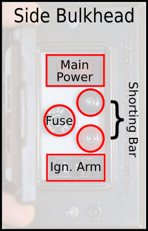
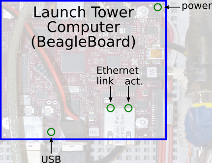
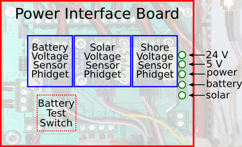
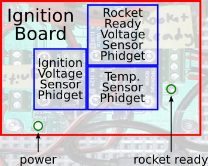

#  Launch Tower Computer Setup

## Procedures for LAUNCH TOWER

**Equipment List**

 - Launch tower computer
 - 2x 12 volt batteries with Anderson PowerPole (APP) connectors
 - Solar Panel
 - LTC Field Box
    - Ignitor cables
    - APP cables
    - Shorting bar (sometimes called "launch key", but really called "shorting bar")
    - N connector coax for LTC antenna

**Required Tools**

 - Miniature flathead screwdriver
 - Large Phillips screwdriver
 - DMM

### Mount To Tower

 1. **Mount** LTC box to the launch tower.
 1. Turn power and arming switches on side bulkhead to **off**.
    - Verify that the arming switch actually turns off using the DMM in "beep" mode
 1. Verify shorting bar is in place on side bulkhead.
    - Verify that shorting bar actually shorts using the DMM in "beep" mode.
 1. Check fuse on side bulkhead.

### Power Connections

 1. Run **battery cables** though bottom bulkhead opening A, and connect to upper left Powerpole connector.
 1. Run **solar panel cables** through bottom bulkhead opening A, and connect to lower left Powerpole connector.
 1. Run **ignition cables** through bottom bulkhead opening A, and connect to upper right Powerpole connector.
    - Verify that the Away Box is empty (there's no shorting bar in it).
 1. Attach launch tower computer interlock box to LTC with caribiner
 1. Verify that the following indicators are illuminated:
    - **BATT** LED on the power interface board
    - **SOLAR** LED on the power interface board

### Data Connections

1. Connect rocket umbilical cable to connector on lower left of bottom bulkhead.
1. Connect WiFi antenna cable to connector on lower right of bottom bulkhead.

### Power-On

 1. Launch control prepares for LTC bring up. Coordinate with launch control to proceed
 1. Turn on the red LTC power switch on side bulkhead. (It should illuminate)
 1. Verify that the following indicators are illuminated:
    - LTC power switch
    - **PWR** LED on power interface board
    - **5V** LED on power interface board
    - **PWR** LED on ignition board
    - **Power** LED on BeagleBoard
    - **USB** hub power LED on BeagleBoard
 1. _Notify launch control team that LTC has been powered on_.  Wait for launch control team to confirm a remote connection to the LTC.
 1. Replace bottom bulkhead cover plate.
 1. Connect internal **ignition battery**. _Notify launch control team_. Wait for confirmation.

Launch Tower done, unless a launch test is requested.

## Procedures for LAUNCH CONTROL

 1. Make sure Launch Control is set up
 1. _Wait for notification of LTC poweron_
 1. Begin to ping the LTC on the wireless address
 1. Start launch tower computer software:

         $ ./ltc.py

 1. Wait for launch-tower-comm to connect
 1. If launch-tower-comm does not connect, you may need to start the phidgetswebservice (it is automatically executed on system boot). To do this:
    - Open ssh session on LTC. Login as `root` and execute:
 
            # phidgetwebservice21 -v

## LTC Poweroff Sequence

 1. Confirm filesystem is in read-only mode
 1. `# poweroff -t now`
 1. Turn off power switch.

## Reference

### Suggested Radio Responses

1. LTC is connected to network: "I see your beagles coming in hot." -- Nathan
1. Confirm LTC you heard LTC is up: "Copy. Hot dogs on the move." -- Theo

### LTC User Accounts

 Username | Password
 -------- | --------
 root     | psaslv1b
 ltc      | ltc

### LTC Network Configuration

 Parameter                  | Value
 -------------------------- | -----
 WiFi (wlan0) IP Address    | 10.0.0.2
 Ethernet (eth0) IP Address | 10.10.10.1
 USB Wifi Mac Address       | 00:c0:ca:32:b7:17
 Ethernet Mac Address       | 2a:d3:77:aa:1e:f7

### LTC WiFi Access Point Configuration

 Parameter        | Value
 ---------------- | -----
 Channel          | 802.11b ch. 11
 SSID             | psas
 WPA-2 Passphrase | psasrocket
 AP IP Address    | 10.0.0.0/24
 Static Range     | 10.0.0.1 - 10.0.0.9
 DHCP Range       | 10.0.0.10 - 10.0.0.249

### Common LTC Commands

 - Reboot computer without delay:

        # reboot –t now

 -  Shut down computer without delay:

        # poweroff –t now

 - View IP addresses assigned to network interfaces:

        # ip address show

 - Make filesystem read/write

        # remount_root_rw

 - Make filesystem read only

        # remount_root_ro

### Figures

